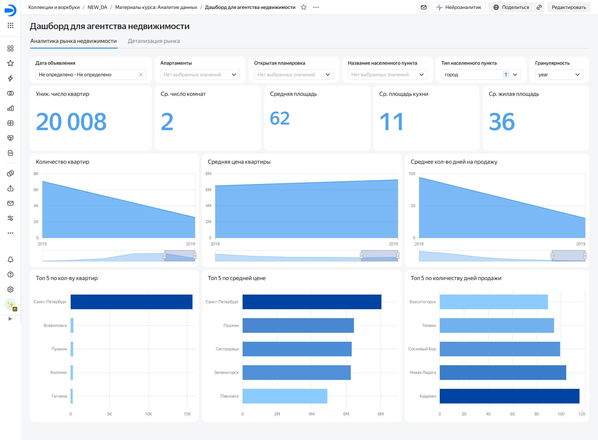
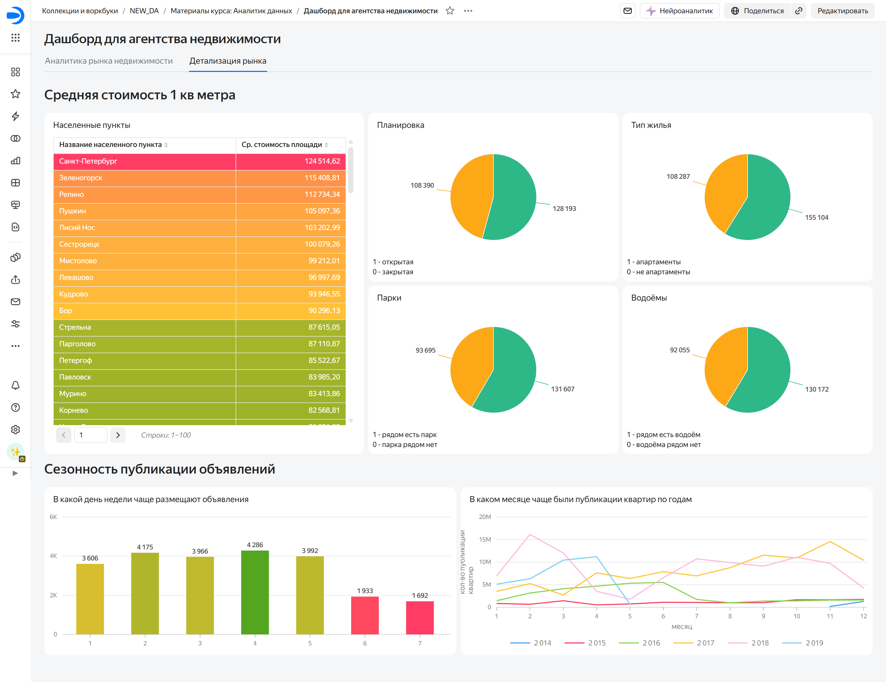

# 🏢 Real Estate Market Analytics: St. Petersburg & Leningrad Region
> **Двуязычное описание / Bilingual Documentation** (Русский | English)

**Интерактивный дашборд / Live Interactive Dashboard:** [View in Yandex DataLens](https://datalens.ru/1u22ejzhbiimn-dashbord-dlya-agentstva-nedvizhimosti)

---

## 🇷🇺 Русскоязычная версия

### 📌 Описание проекта
Проект выполнен для агентства недвижимости, которое планирует выйти на рынок Санкт-Петербурга и Ленинградской области. Для разработки бизнес-стратегии, выбора наиболее перспективных сегментов и планирования сроков старта работы потребовался комплексный анализ архивных данных сервиса Яндекс Недвижимость (`real_estate` database schema).

### 🎯 Бизнес-задачи проекта
* **Оценка привлекательности сегментов (Ad hoc 1):** Определение наиболее привлекательных типов недвижимости в Санкт-Петербурге и городах Ленинградской области на основе времени активности объявлений (скорости продажи).
* **Анализ сезонных тенденций (Ad hoc 2):** Выявление пиков и спадов активности покупателей и продавцов для оптимального планирования маркетинговых кампаний и сроков вывода услуг на новый рынок.
* **Разработка BI-дашборда:** Создание интерактивного дашборда в Yandex DataLens для визуализации ключевых показателей рынка и оперативного отслеживания метрик заказчиком.

### 🛠 Технический стек и методология
* **СУБД:** PostgreSQL (работа с реляционной базой данных `real_estate` через DBeaver).
* **SQL:**
  * Объединение таблиц (`JOIN`), группировка и агрегация данных (`GROUP BY`, `AVG`, `MEDIAN`).
  * Фильтрация, подзапросы и составление сложных запросов для решения ad hoc задач.
  * Работа с датами и временными рядами (`EXTRACT`, `DATE_TRUNC`) для анализа сезонности.
* **BI-платформа:** Yandex DataLens (проектирование дашборда, настройка виджетов, расчетных полей и параметрических селекторов).

### 📊 Структура проекта
1. **Ad hoc исследование 1 (Ликвидность и сегменты):** Анализ медианного времени жизни объявлений в зависимости от локации, комнатности и площади.
2. **Ad hoc исследование 2 (Динамика и сезонность):** Определение месяцев с наибольшим притоком новых объявлений и закрытием сделок.
3. **DataLens Dashboard:** Интерактивная система мониторинга рынка недвижимости (цена за м², скорость продажи, распределение по регионам).

---

## 🇬🇧 English Version

### 📌 Project Overview
This project was executed for a real estate agency planning to enter the St. Petersburg and Leningrad Region market. To guide business strategy, identify high-demand property segments, and determine launch timelines, an end-to-end analysis was conducted using historical listing data from Yandex Real Estate (`real_estate` PostgreSQL database schema).

### 🎯 Business Requirements & Scope
* **Segment Attractiveness & Liquidity (Ad hoc 1):** Identifying high-demand, fast-selling real estate segments across St. Petersburg and regional towns based on listing active duration.
* **Seasonal Trend Analysis (Ad hoc 2):** Evaluating supply and demand seasonality to determine optimal time windows for market entry and targeted marketing campaigns.
* **BI Dashboard Development:** Building an interactive Yandex DataLens dashboard to visualize key housing metrics and provide dynamic monitoring for stakeholders.

### 🛠 Technical Architecture & Tools
* **Database Management System:** PostgreSQL (data exploration and query execution via DBeaver).
* **SQL:**
  * Relational table joins (`JOIN`), data grouping and aggregation (`GROUP BY`, `AVG`, `MEDIAN`).
  * Filtering, subqueries, and complex SQL logic for ad hoc query tasks.
  * Time-series extraction and date manipulation (`EXTRACT`, `DATE_TRUNC`) for seasonal trend mapping.
* **BI & Visualization:** Yandex DataLens (dashboard architecture, visual widgets, custom calculated fields, dynamic parameters).

### 📊 Key Insights & Deliverables
1. **Ad hoc Analysis 1 (Market Liquidity):** Evaluated median time-on-market across property types, location tiers, and room configurations.
2. **Ad hoc Analysis 2 (Market Seasonality):** Identified peak buyer/seller activity periods throughout the calendar year.
3. **DataLens Dashboard:** Interactive visual monitoring of key housing metrics (price per sq. meter, sale speed, geographic breakdown).

---

## 📂 Проекты и скрипты / Project Files
* [`real_estate_adhoc_queries.sql`](./real_estate_adhoc_queries.sql) — SQL-запросы для ad hoc задач с комментариями / Commented SQL scripts for ad hoc queries.

---

## 🖼 Предпросмотр дашборда / Dashboard Preview

---

## 📬 Контакты / Contact
* **Автор / Author:** Maryna Auchynnikava
* **LinkedIn:** [linkedin.com/in/maryna-auchynnikava](https://www.linkedin.com/in/maryna-auchynnikava/)
* **Email:** maryna.auchynnikava@gmail.com
