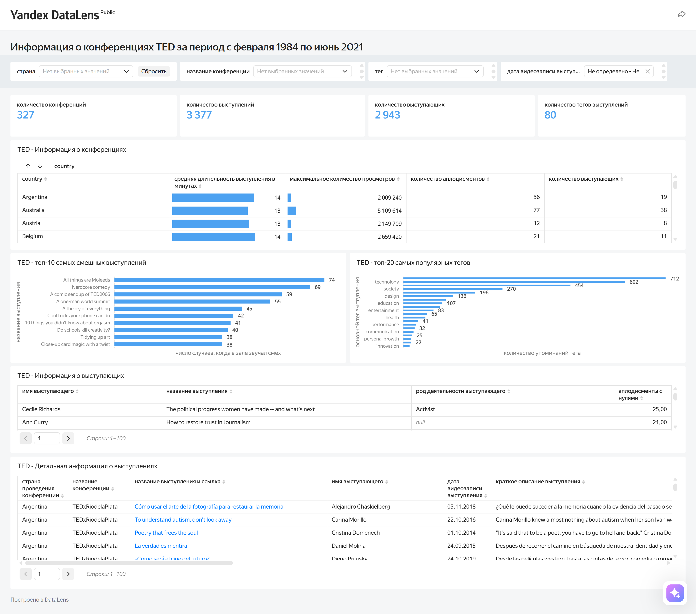

# 📊 TED Talks Analytics Dashboard: Event Planning & Insights
> **Двуязычное описание / Bilingual Documentation** (Русский | English)

**Интерактивный дашборд / Live Interactive Dashboard:** [View in Yandex DataLens](https://datalens.yandex/tkndpnoxsdwqf)

---

## 🇷🇺 Русскоязычная версия

### 📌 Описание проекта
Данный проект разработан для компании, лицензировавшей проведение конференций TED. На этапе организации первого мероприятия заказчику требовался аналитический инструмент для подбора спикеров, тем и площадок. Дашборд помогает принимать решения на основе исторических данных прошлых конференций TED.

### 🎯 Бизнес-задачи проекта
* **Контентная стратегия:** Определение наиболее популярных тем и тегов, выявление реакции аудитории.
* **Логистика мероприятия:** Оценка средней длительности выступлений и оптимального количества спикеров на одной конференции.
* **Подбор спикеров:** Анализ родов деятельности и профилей выступающих, вызывающих наибольший отклик зрителей (по уровню аплодисментов и смеха).

### 🛠 Технический стек и методология
* **Подготовка данных:** Использование связей `LEFT JOIN` в базе данных для сохранения полноты учета всех конференций (включая мероприятия без отдельных записей).
* **BI-инструмент:** Yandex DataLens.
* **Методы анализа:** Агрегатные функции, ранжирование (Top-N), когортный анализ тегов, параметрическая фильтрация.

### 📊 Структура и функционал дашборда
1. **Обзор показателей верхнего уровня:** Общее количество конференций, выступлений, уникальных спикеров и тегов для оценки объема базы данных.
2. **Детализация по странам и конференциям:** Средняя продолжительность выступлений, максимум просмотров, подсчет аплодисментов и количества спикеров.
3. **Глубокий анализ выступлений и спикеров:** Топ-20 популярных тегов, Топ-10 самых смешных выступлений, анализ рода деятельности популярных спикеров и таблица детального просмотра конкретных лекций.
4. **Интерактивные селекторы:** Фильтрация данных по **стране**, **названию конференции**, **тегу выступления** и **дате записи**.

---

## 🇬🇧 English Version

### 📌 Project Overview
This project addresses a real-world business mandate: an agency licensing the TED brand needed an evidence-based tool to plan its inaugural TED conference. By analyzing historical TED Talks data, this interactive dashboard provides decision-makers with actionable insights into popular themes, audience engagement, speaker demographics, and optimal event structuring.

### 🎯 Business Requirements & Scope
The client required data-driven answers to core event-planning questions:
* **Content Strategy:** Which topics and tags generate the highest audience engagement?
* **Event Logistics:** What is the optimal conference timing, average talk duration, and speaker capacity?
* **Speaker Selection:** What profiles and occupations of speakers resonate most with viewers (based on audience laughter and applause)?

### 🛠 Technical Architecture & Data Lifecycle
* **Data Sources & Joins:** Built on relational datasets of historical TED events. Executed SQL query logic using `LEFT JOIN` to ensure 100% of conferences were retained in baseline metrics, including events without individual recordings.
* **BI Platform:** Yandex DataLens.
* **Analytical Techniques:** Aggregation functions, cohort/tag categorization, top-N ranking, and multi-variable filtering.

### 📊 Key Dashboard Features & Structure
1. **High-Level Executive Summary:** Total conferences, total performances, unique speakers, and unique tags to establish data scope.
2. **Country & Event Breakdown:** Performance duration, maximum views, total audience applause, and speaker ratios per conference.
3. **Deep-Dive Analytics:** Top-20 popular tags, Top-10 funniest talks (humor/applause metrics), speaker professional background analysis, and granular talk-level detail tables.
4. **Interactive Controls:** Dynamic multi-parameter filtering by **Country**, **Conference Name**, **Talk Tag**, and **Recording Date**.

---

## 🖼 Предпросмотр дашборда / Dashboard Preview

---

## 📬 Контакты / Contact
* **Автор / Author:** Maryna Auchynnikava
* **LinkedIn:** [linkedin.com/in/maryna-auchynnikava](https://www.linkedin.com/in/maryna-auchynnikava/)
* **Email:** maryna.auchynnikava@gmail.com
